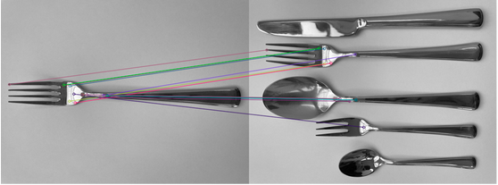
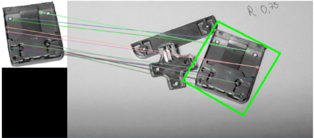
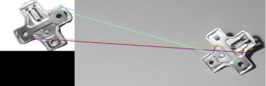
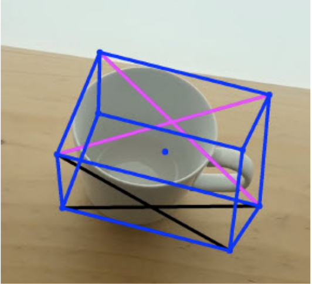

# Code attempts : This directory contains the algorithims we tried but didnot proceede ahead with.

## FLANN_feature_matching.py

It is a feature matching technique built using SIFT (Scale Invariant Feature-Transform). It requires 2 images, 
1. The image of the model object from which image features are extracted.
2. The image of a scene containing the model object. The features from the scene image are extracted.
The features from both the model image and the scene image are matched using the matching algorithm FLANN. If the number of matched features are above a certain threshold, the object will be detected and localized. If there are any good matches they are drawn on the images and diaplayed on a openCV image window.

Test results: 

## homography_feature_detection.py

It is a feature detection technique built using SURF (Speeded-Up Robust Features), which is a more roboust successor of SIFT.
Similar to the SIFT approach, it ectracts feature descriptors from both model image and scene image. The extarcted feature descriptors are matched using the FLANN feature matching technique. If the metched features are above a certain treshold number of features, the obhect in the scene image is detected and loaclized.

Even-though the SURF detector is robust, it is not open source.

Test results : 
- Positive matches:

- Negative matches: 

## mediapipe_detection.py

Addition to object detection, this method can do pose estimation and localization. It uses Objectron dataset, which is annotated for a set of objects. So, this method can only detect a set of objects like mugs, shoes, boxes, etc.
- The script activate the webcam and tries to detect and localize the objects using *objectron.process(image)* from the camera video feed. It works realtime with better performance only with RGB images. 
- When an object is detected, it draws a 3d bounding box along with axes on the image.
Test results:

##### Resources 
- FLANN - https://docs.opencv.org/4.x/d5/d6f/tutorial_feature_flann_matcher.html
- SURF - https://docs.opencv.org/4.x/d7/d66/tutorial_feature_detection.html
- SIFT - Research paper titled “Object recognition from local scale-invariant features”
    - Authors : D. G. Lowe
- mediapipe - Research paper titled “Mo-bilepose: Real-time pose estimation for unseen objects with weak shapesupervision"
    - Authors: Hou, A. Ahmadyan, L. Zhang, J. Wei, and M. Grundmann,  
